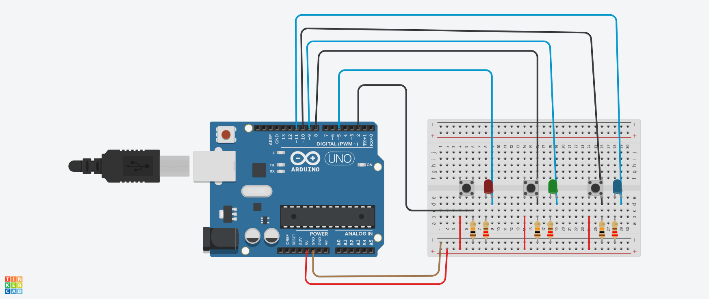

# 3 Buttons & 3 LEDs Project

 

Simple Arduino project controlling 3 LEDs with 3 push buttons.

## Components
- Arduino board (Uno/Nano)
- 3x Push buttons
- 3x LEDs
- 3x 220Ω resistors (for LEDs)
- 3x 10kΩ resistors (for buttons)
- Breadboard & jumper wires

## Wiring
| Component | Arduino Pin |
|-----------|-------------|
| Button 1  | Digital 2   |
| Button 2  | Digital 8   |
| Button 3  | Digital 10  |
| LED 1     | Digital 5   |
| LED 2     | Digital 9   |
| LED 3     | Digital 11  |

## Code
Upload `3Buttons_3Leds.ino` to your Arduino:
- Press each button to light its corresponding LED
- Release button to turn LED off
